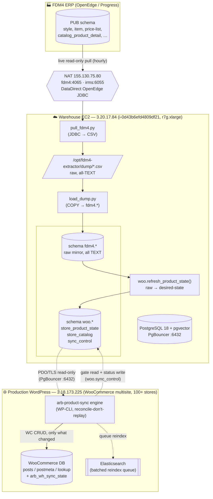
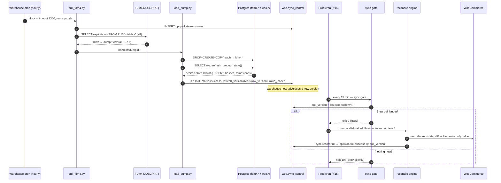
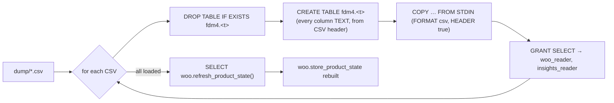
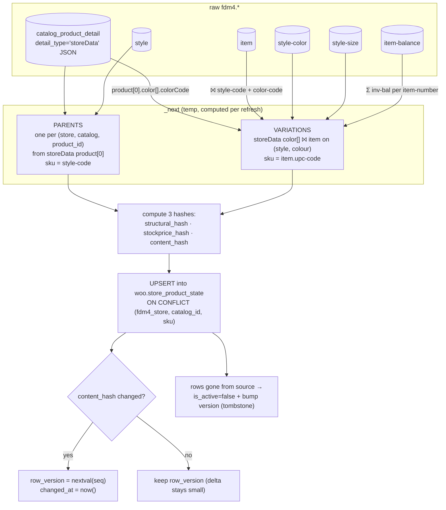
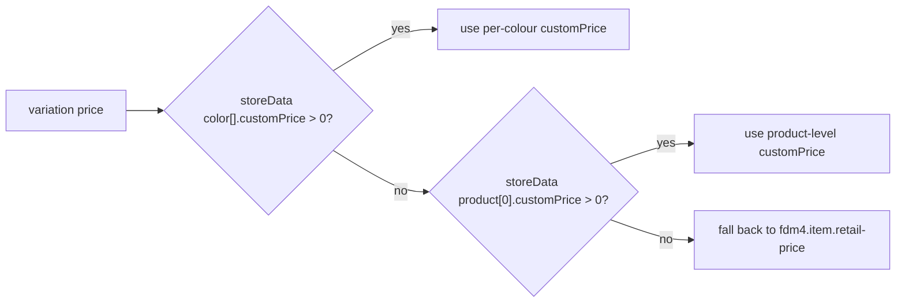
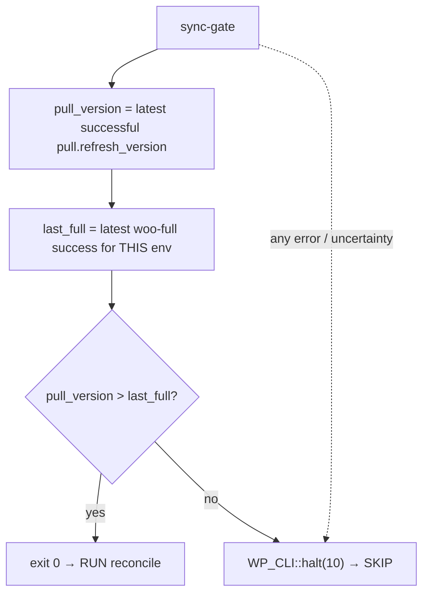
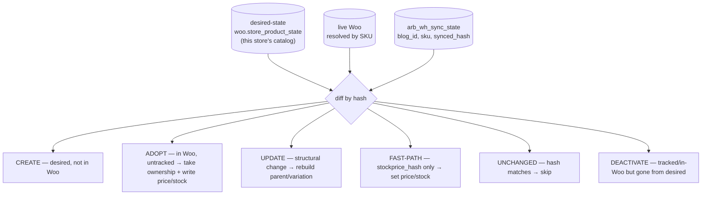
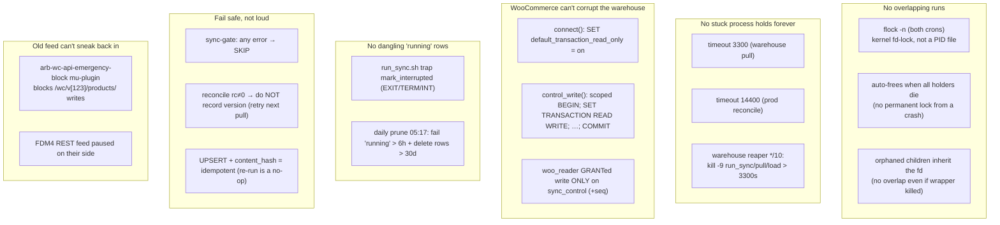

# FDM4 → Postgres → WooCommerce Product Sync — Full Technical Reference

**The "ODBC process" end-to-end, plus every protection mechanism.**

Status: **LIVE on production, fully automated, hands-off** since 2026-06-23.
Last verified cycle: pull `v3952361` (259,107 rows) → reconcile 73 stores in 74s, 0 errors → `IN SYNC`.

> **Terminology note.** This is referred to internally as the "ODBC process," but the
> live FDM4 connection is technically **JDBC** — the DataDirect OpenEdge JDBC driver
> driven from Python (`jaydebeapi`). There is no ODBC layer. Everything below uses
> "the pull" for that stage.

---

## 1. Why this exists

FDM4 (the ERP) used to push the product catalog into WooCommerce by hammering the
**WooCommerce REST API** (`/wc/v3/products`, `/variations/batch`) on a feed. That feed
was fragile: it replayed the entire catalog, could flood the site (the 2026-06-11
feed-flood), raced with itself, and gave us no control over timing or correctness.

This system **replaces that feed** with a **reconcile-don't-replay** pipeline:

1. **Pull** FDM4's raw product tables into a Postgres **warehouse** (read-only mirror).
2. **Transform** them into a **desired-state** table — exactly what each store's catalog
   *should* look like in Woo.
3. **Reconcile** Woo against that desired-state from inside WordPress (WP-CLI + WC CRUD),
   touching only what actually changed.

The FDM4 REST feed is **shut off** (paused on their side + blocked defensively by the
`arb-wc-api-emergency-block` mu-plugin — see §9).

---

## 2. Structure / topology



**Two boxes, decoupled by a control table.** The warehouse refreshes itself on its own
clock; production decides independently whether there's anything new worth reconciling.
Neither blocks the other. The only shared state is `woo.sync_control` (§6).

---

## 3. End-to-end flow (one full cycle)



Steady state: **warehouse pull ≈ 7.5 min** (24×/day), **prod reconcile ≈ 71s for 73
stores**, gate skips the other ~3 ticks/hour for free.

---

## 4. Stage 1 — PULL (`db-test/pull_fdm4.py`, runs on the warehouse box)

Streams 8 FDM4 `PUB` tables to CSV. Run by `run_sync.sh` as root (reads the 0600 creds).

| # | FDM4 table | Role in the model |
|---|------------|-------------------|
| 1 | `style` | parent product (style-code = parent SKU), name, item-status |
| 2 | `style-color` | colour-code → colour description |
| 3 | `style-size` | size-code → size description |
| 4 | `item` | the sellable item: style+colour+size, **upc-code = variation SKU**, retail-price, active |
| 5 | `price-list` | price-categ / price-method (⚠️ **not currently read** — see §12) |
| 6 | `item-balance` | inventory; summed per item-number → stock |
| 7 | `catalog_product` | catalog membership |
| 8 | `catalog_product_detail` | per-store **`storeData` JSON** — which colours each store/catalog offers + `customPrice` |

Key implementation details:

- **JDBC over the NAT** (`155.130.75.80`, port 4065) via the DataDirect OpenEdge driver.
- **Explicit column list, never `SELECT *`.** The driver truncates character columns to
  their *display width* on `SELECT *` (e.g. the `storeData` JSON came back clipped to 40
  chars). Naming every column returns full SQL width. This is load-bearing — `SELECT *`
  silently corrupts the JSON.
- **Raw layer = all TEXT.** Every value is written as a string; no type-casting here.
  Casting happens in the transform. This keeps the pull faithful and dumb.
- Output: `dump/<table>.csv` + `manifest.json` (row counts), `BATCH = 5000`.
- Connection set read-only (`setReadOnly(true)`) — FDM4 is never written.

---

## 5. Stage 2 — LOAD (`db-test/infra/load_dump.py`, runs as `postgres`)



- **Idempotent**: each table is fully dropped + recreated from its CSV header — no schema
  drift, no partial state. All columns `text`.
- Local **peer auth** (`/var/run/postgresql`, user `postgres`) — no password on disk.
- After loading, it **calls the transform itself** (guarded by `to_regprocedure(...)` so
  it's a no-op if the transform function isn't installed yet). So `load → desired-state`
  is one atomic step, not two crons.

---

## 6. Stage 3 — TRANSFORM (`db-test/sql/woo_transform.sql` → `woo.refresh_product_state()`)

Turns the raw `fdm4.*` mirror into the **desired-state** the Woo engine reads:
`woo.store_product_state`, **keyed `(fdm4_store, catalog_id, sku)`**.



### 6.1 The desired-state model

- **Parents** — one row per `(store, catalog, product)` from each store's `storeData`
  JSON (`catalog_product_detail`, `detail_type='storeData'`, `site_id ~ '^S_'`). `sku =
  style-code`, `kind='parent'`.
- **Variations** — `kind='variation'`, `sku = item.upc-code`. Built by exploding the
  store's `storeData product[0].color[]` array and **joining `fdm4.item` on (style-code,
  color-code)**. So a variation exists for a store **only if that store's catalog lists
  the colour**. (This is why a store with an empty `color[]` array gets *no* variations —
  see §12.)
- **Colour/size names** from `style-color` / `style-size`; **stock** = `Σ item-balance.inv-bal`
  per `item-number`.

### 6.2 Price resolution (important — see §12 for the gap)



The `retail-price` fallback exists because FDM4 sometimes ships `customPrice = 0` for
items that *do* have a real retail price — without it those landed in Woo (and on orders)
as **$0** (the 112-DAV-ST / 8050-STAR bug, fixed 2026-06). **`fdm4.price-list` is not
consulted at all** — relevant to special-pricing questions (§12).

### 6.3 Change-tracking (what makes deltas cheap and idempotent)

- **UPSERT, not DELETE+INSERT.** A row's `row_version` (a monotonic sequence) advances
  **only when its `content_hash` actually changes**. Unchanged rows keep their version.
- **Split hashes**: `structural_hash` (name/status/colour/size/active) vs `stockprice_hash`
  (price/stock). Together they cover the whole payload, so the Woo engine can route a
  *stock/price-only* change to a fast path and a *structural* change to a full rebuild.
- **Tombstones**: a row that disappears from FDM4 is set `is_active=false` with a bumped
  version (not deleted), so the per-store delta still carries the removal → the engine
  deactivates it in Woo.
- **Deterministic `DISTINCT ON`** ordering so duplicate `storeData` rows produce a stable
  payload run-to-run (otherwise hashes would churn and every row would look "changed").
- **Catalog-aware**: one store (`site_id`) can host several catalogs (a real one + clone/
  demo catalogs with different prices). `woo.store_catalog` summarises catalogs per store
  and flags a `suggested` primary; the engine picks **one** catalog per blog.

---

## 7. The control table — `woo.sync_control` (the coordination point)

The single piece of shared state between the two boxes.

| column | meaning |
|--------|---------|
| `op` | `pull` \| `woo-full` \| `woo-delta` \| `targeted` |
| `env` | `global` (pulls) \| `production` \| `development` (reconciles) |
| `status` | `requested` \| `running` \| `success` \| `failed` |
| `refresh_version` | warehouse version = `MAX(woo.store_product_state.row_version)` |
| `rows_loaded`, `started_at`, `finished_at`, `requested_by`, `error`, `note`, `payload` | bookkeeping |

- **`run_sync.sh`** writes the `pull/global` rows (`running` → `success` with the new
  `refresh_version` + active row count, or `failed`).
- **Production WP** writes its `woo-full/production` rows via `sync-record-full`.
- **`env` is derived from the network domain**, not `WP_ENVIRONMENT_TYPE` (which is
  undefined on both boxes): `arborwear.com → production`, `arb-dev.arborwear.com →
  development`. Prevents dev and prod from clobbering each other's watermark.

### 7.1 The gate

`wp arb_product_sync sync-gate`:



Because the reconcile cron fires every 15 min but pulls land hourly, the gate makes ~3 of
every 4 ticks a no-op — and crucially it **fails safe**: any error or ambiguity returns
SKIP, never a runaway reconcile.

---

## 8. Stage 4 — RECONCILE (the WordPress engine: `arb-product-sync`)

Plugin: `wp-content/plugins/arb-product-sync/`. Core classes:
`ARB_Warehouse_DB` (Postgres access), `ARB_Product_Sync_Engine`, the CLI, and
`ARB_Store_Sync_Map` (per-blog → fdm4_store/catalog mapping + master switch).

### 8.1 Reconcile-don't-replay

For each enabled store the engine reads the store's desired-state from Postgres, reads
the live Woo catalog, diffs them, and routes every SKU into a bucket:



- **Sync-state `arb_wh_sync_state`** = `(blog_id, sku, fdm4_store, style_code, synced_hash)`
  — **no `woo_id`**. The Woo post ID is resolved **live by SKU each run** (status-filtered,
  self-healing; a trashed product is never adopted). Blog IDs drift across dev/stg/prod,
  so nothing env-specific is stored in the warehouse.
- **Hooks suspended** during bulk writes (GLA / HubSpot / Avatax / fanout) so a reconcile
  doesn't trigger 73× downstream side-effects.
- **ES reindex is queued + batched**, not per-product.
- Full reconcile **bakes in cleanup** end-to-end: reparent → purge-orphans →
  purge-skuless → purge-dupe-drafts (proven 0-residual on fresh stores).

### 8.2 What made hourly viable (W2 optimizations: 117 min → 71 s)

| # | change | effect |
|---|--------|--------|
| **#1** | `filter_unretired()` — batch-skip SKUs already retired in Woo | killed deactivation churn (blog 1: 14,987 → 0 ops/run) |
| **#2** | attribute-repair scoped to **changed-this-run** parents on routine runs; **all** parents only on `--deep` | routine runs stop re-touching the whole catalog |
| **#3** | `batch_deactivate()` — set-based meta/post/lookup/visibility writes | first-pass deactivation no longer per-product |

`run-parallel` is a `proc_open` worker pool (`--concurrency` default 4, **cap 8**), each
child a full `wp arb_product_sync sync` for one store. `--deep` runs Sundays 04:xx only.

> **Dropped:** "#42" (a SQL parent-price rollup to replace `WC_Product_Variable::sync`)
> was deliberately **not** built — hourly cadence makes per-parent sync cost negligible,
> and the multi-currency price-math risk wasn't worth it.

---

## 9. Protection mechanisms (the whole point of "hands-off")



### 9.1 `flock -n` — no overlap (verified behaviour)

Both wrappers run under `flock -n <lockfile>`. Tested facts:

- It's a **kernel fd-lock**, not a PID file — nothing to clean up manually.
- It **auto-frees when all holders die**, so a crash never leaves a permanent lock.
- **Orphaned children inherit the open fd**, so even if the wrapper is killed mid-run, the
  still-running child keeps the lock → the next tick can't overlap it.
- The one gap — a **hung-but-alive** run holding the lock forever — is closed by the
  `timeout`/reaper below.

### 9.2 `timeout` + reaper — no stuck process

- Warehouse pull: `timeout 3300` (55 min) **plus** a `*/10` reaper that `kill -9`s any
  `run_sync.sh`/`pull_fdm4`/`load_dump` running > 3300 s (belt-and-suspenders for child
  processes). The reaper awk uses `[r]un_sync`-style bracket tricks to avoid matching its
  own `ps` line.
- Prod reconcile: `timeout 14400` (4 h) in the cron line **is** the reaper — a wedged
  reconcile self-terminates, and `flock` means the next tick simply waits.

### 9.3 Warehouse can't be corrupted by WordPress

The WP Postgres connection is **read-only by default** (`SET default_transaction_read_only
= on`). The **only** write path is `ARB_Warehouse_DB::control_write()`, which wraps each
write in `BEGIN; SET TRANSACTION READ WRITE; …; COMMIT`. The `woo_reader` role is GRANTed
write **only** on `woo.sync_control` and its sequence — the data tables
(`store_product_state`, `fdm4.*`) are physically un-writable from WP. (Verified: an
unscoped INSERT against a data table is rejected with "cannot execute INSERT in a
read-only transaction.")

### 9.4 No dangling control rows

`run_sync.sh` traps `EXIT/TERM/INT` → `mark_interrupted` flips a still-`running` row to
`failed` (idempotent — a normal success/failure already set the final status). `SIGKILL`
can't be trapped, so the **daily prune** (`17 5 * * *`) is the backstop: fail any
`running` row older than 6 h, and delete control rows older than 30 days.

### 9.5 Fail safe, not loud

- `sync-gate` returns **SKIP** on any error or uncertainty — the system idles rather than
  runs amok.
- If `run-parallel` exits non-zero, `arb-hourly-reconcile.sh` **does not** call
  `sync-record-full`, so the env's watermark stays behind → the **next** pull re-triggers
  a reconcile automatically (self-healing retry).
- The whole pipeline is **idempotent**: re-running a pull or a reconcile with no source
  change is a no-op (UPSERT + `content_hash`, hash-keyed sync-state).

### 9.6 Old feed is fenced off

The `arb-wc-api-emergency-block` mu-plugin blocks `/wc/v[123]/products/` REST writes
(catches `/products/<id>` and `/variations/batch` — FDM4's real write path), toggled by
`touch`/`rm wp-content/.wc-api-blocked`. FDM4's product feed is also paused on their side.
Bare `GET /wc/v3/products` is *not* blocked (reads still work).

---

## 10. Automation / cadence (the actual crons)

### Warehouse box `3.20.17.84` — root crontab
```cron
# Hourly live FDM4 pull → load → transform (≈7.5 min). flock = no overlap, timeout = hard cap.
0 * * * *   /usr/bin/flock -n /tmp/fdm4-pull.lock /usr/bin/timeout 3300 /bin/bash /opt/fdm4-extractor/run_sync.sh >> /opt/fdm4-extractor/run_sync.log 2>&1

# Reaper: kill any pull/load wedged past 3300s.
*/10 * * * * ps -eo pid,etimes,args | awk '/[r]un_sync.sh|[p]ull_fdm4|[l]oad_dump/ && $2>3300 {print $1}' | xargs -r kill -9

# Prune: fail stale 'running' rows >6h + delete control rows >30d.
17 5 * * *  sudo -u postgres psql -d arb_warehouse -tAc "UPDATE woo.sync_control SET status='failed', error=COALESCE(error,'stale running') WHERE status='running' AND started_at < now()-interval '6 hours'; DELETE FROM woo.sync_control WHERE requested_at < now()-interval '30 days'" >/dev/null 2>&1
```

### Production WP `3.18.173.225` — **www-data** crontab
```cron
# Gated full reconcile every 15 min. flock = no overlap, timeout 14400 (4h) = reaper.
*/15 * * * * /usr/bin/flock -n /var/www/arborwear/wp-content/private-logs/.product-sync.lock /usr/bin/timeout 14400 /bin/bash /usr/local/bin/arb-hourly-reconcile.sh >> /var/www/arborwear/wp-content/private-logs/hourly-reconcile.log 2>&1
```
> ⚠️ Note this lives in **www-data**'s crontab (`crontab -u www-data -l`), not ubuntu/root.

`/usr/local/bin/arb-hourly-reconcile.sh`:
1. `sync-gate` → exit 0 = RUN, 10 = SKIP silently, other = error.
2. `--deep` only on Sunday 04:xx (weekly blanket attr-repair); routine otherwise.
3. `wp arb_product_sync run-parallel --all --full-reconcile --execute --concurrency=8 [--deep]`
4. On success → `sync-record-full` (writes the `woo-full/production` watermark).
5. On failure → log + **don't** record (so the next pull retries).

### Log management — `/etc/logrotate.d/arb-sync` (both boxes)
`weekly`, `rotate 4`, `compress`, `missingok`, `notifempty`, `copytruncate` on
`hourly-reconcile.log` + `product-sync-baseline.log`.

### Timeline

```mermaid
gantt
    dateFormat HH:mm
    axisFormat %H:%M
    title One hour of the live cadence
    section Warehouse
    Pull then Load then Transform (~7.5m)   :w1, 00:00, 8m
    section Prod reconcile (gated, every 15m)
    tick 00 — gate SKIP (no new pull yet)   :crit,   00:00, 1m
    tick 15 — gate RUN reconcile (~71s)     :active, 00:15, 2m
    tick 30 — gate SKIP                     :crit,   00:30, 1m
    tick 45 — gate SKIP                     :crit,   00:45, 1m
```


---

## 11. Monitoring & operations

**The one command:** `wp arb_product_sync sync-status` →
```
env: production · last pull: vNNN (rows) · last reconcile: vNNN · in-progress rows
VERDICT: IN SYNC | LAGGING | PULL STALE | STUCK | NO PULL
```
> Do **not** use `pgrep -f` to check if a run is active — it self-matches the grep command
> and reports false positives. Use `sync-status` (reads the control table) instead.

**Control table at a glance** (on the warehouse):
```sql
SELECT op, env, status, refresh_version, started_at, finished_at
FROM woo.sync_control ORDER BY id DESC LIMIT 10;
```

**Manual operations:**
| Action | Command |
|--------|---------|
| Force a warehouse refresh now | `sudo bash /opt/fdm4-extractor/run_sync.sh` (on the box) |
| Reconcile one store | `wp arb_product_sync sync --blog_id=N --full-reconcile --execute` |
| Reconcile specific SKUs | `wp arb_product_sync sync --blog_id=N --products=SKU1,SKU2 --execute` |
| Dry-run (plan only) | drop `--execute` (default is plan/dry-run) |
| All stores, parallel | `wp arb_product_sync run-parallel --all --full-reconcile --execute -c8` |
| Re-apply the transform | `sudo -u postgres psql -d arb_warehouse -f db-test/sql/woo_transform.sql` |

**Master switches:** the network option `arb_sync_system_enabled` (default OFF per env)
gates everything via `ARB_Store_Sync_Map::can_sync()`; per-blog `sync_enabled` in the
Store Sync Map admin page gates each store.

---

## 12. Known gaps & caveats

- **Per-store pricing rides on `storeData.customPrice`; a `customPrice = 0` falls back to
  retail.** Store-specific/contract pricing is delivered through the per-store
  `storeData.customPrice` field (network-wide, **12,939 / 13,156 = 98%** of products carry
  a real non-zero customPrice). When FDM4 ships `customPrice = 0` for a product, the
  transform correctly falls back to `item.retail-price` — which is usually *not* the
  store's intended price. `fdm4.price-list` (a single `price-categ` with a 10-slot
  `sale-price` *level* array) is FDM4-internal and **not read** — it's the source FDM4
  uses to compute the customPrice it writes into storeData, not a storefront channel.
  *Confirmed root cause of the 820510-D1D / 820511-D1D @ bartlett issue: those are 2 of
  only 3 bartlett products (out of 342) shipped with `customPrice = 0`, so Woo shows the
  $20/$22 retail fallback instead of bartlett's special price. **Fix is FDM4-side**:
  populate `customPrice` for those products in `S_002120_bartlettmain` storeData; the next
  hourly pull + reconcile then carries it through with no code change.*
- **Empty `storeData color[]` → no variations.** If FDM4's per-store `storeData` lists no
  colours for a style, the transform produces no variations and the product won't appear
  for that store (FDM4-config gap on their side, not ours — e.g. 103011 / 102230).
- **Hourly full-table pull** hits FDM4 24×/day over the NAT — watch FDM4-side load.
- **Live NAT creds are temporary** — a permanent dedicated read-only FDM4 account is still
  needed; FDM4 was tightening the NAT port range, so re-validate periodically.
- **Catalog must be pinned per blog** in the Store Sync Map — a store with multiple
  catalogs (real + demo/clone) needs the right one selected or it syncs demo prices.

---

## 13. File / artifact index

| Path | Role |
|------|------|
| `db-test/pull_fdm4.py` | Stage 1 — JDBC pull → CSV |
| `db-test/infra/load_dump.py` | Stage 2 — CSV → `fdm4.*` + calls transform |
| `db-test/sql/woo_transform.sql` | Stage 3 — `woo.refresh_product_state()` desired-state |
| `db-test/sql/sync_control.sql` | `woo.sync_control` DDL + grants |
| `db-test/infra/run_sync.sh` | Warehouse orchestrator (pull→load→transform + control rows + trap) |
| `/usr/local/bin/arb-hourly-reconcile.sh` | Prod orchestrator (gate→reconcile→record) |
| `wp-content/plugins/arb-product-sync/` | The WP reconcile engine + CLI + Store Sync Map |
| `wp-content/mu-plugins/arb-wc-api-emergency-block.php` | Fences off the old FDM4 REST feed |
| `ARB_PRODUCT_SYNC_PLAN.md`, `ARB_SYNC_OPTIMIZATION_DISCOVERY.md` | Design + optimization history |

---

*Live values current as of 2026-06-23: 73 stores, hourly pull ≈ 259k rows / 7.5 min,
prod reconcile ≈ 71 s, gate-driven `*/15`, 0 errors steady-state.*
